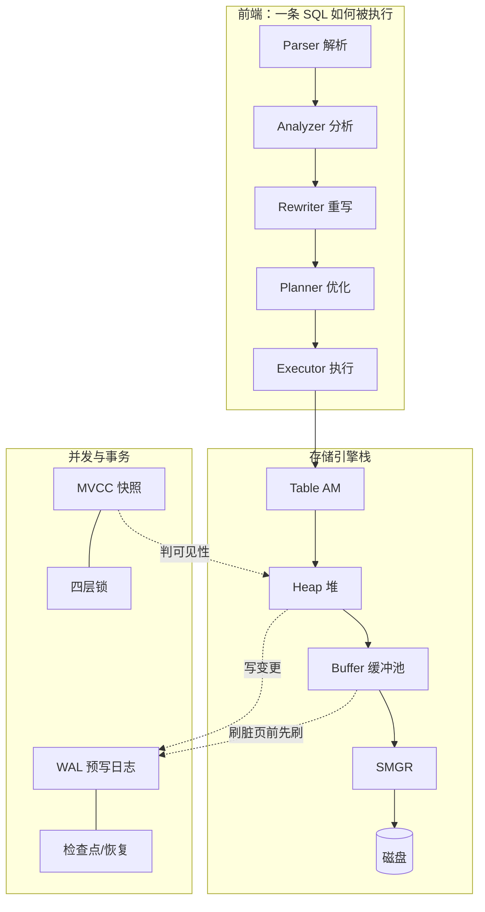

# 00 · 为什么要读 PostgreSQL 源码

> 本文是「深入 PostgreSQL 内核」系列的序章。我们不急着看代码，先建立一个能撑起整个系列的全局直觉——并从一个会让多数后端工程师愣一下的事实开始。

---

## 一个反直觉的开场

打开一个终端，连上你刚建好的 PostgreSQL（环境搭建见[系列总入口](README.md)），然后在**另一个**终端跑一句：

```bash
$ ps -o pid,ppid,command -C postgres
```

```
    PID    PPID COMMAND
  96305    3845 postgres -D /home/teletele/postgres/data   ← postmaster（根进程）
  96306   96305 postgres: io worker 0
  96307   96305 postgres: io worker 1
  96308   96305 postgres: checkpointer
  96309   96305 postgres: background writer
  96311   96305 postgres: walwriter
  96312   96305 postgres: autovacuum launcher
  96313   96305 postgres: logical replication launcher
  97261   96305 postgres: teletele postgres [local] idle    ← 你的连接
```

注意两件事：

1. **它不是一个进程，是一窝进程。** 所有进程的父进程都是 `96305`——那个叫 postmaster 的根进程。
2. **你的每一个连接，对应一个独立的操作系统进程**（最后那行 `97261`）。再开一个 `psql`，就再多一个进程。

换个角度看同样的事实：

```sql
postgres=# SELECT backend_type, count(*) FROM pg_stat_activity GROUP BY backend_type;
         backend_type         | count
------------------------------+-------
 client backend               |     1   ← 你
 checkpointer                 |     1
 background writer            |     1
 walwriter                    |     1
 autovacuum launcher          |     1
 io worker                    |     2
 logical replication launcher |     1
```

如果你来自 MySQL/Redis/大多数现代服务的世界，第一反应可能是：**为什么不用线程池？** 一个连接一个进程，进程比线程重得多，fork 也慢，进程间还不能直接共享内存——这看起来是个糟糕的设计。

但这恰恰是理解 PostgreSQL 内核的**第一把钥匙**。

---

## 这个设计换来了什么

PostgreSQL 选择多进程，核心是用「重」换「稳」。一个最直白的体现——我们来把一个 backend **搞崩**，看看会发生什么。

```sql
-- 会话 A：拿到自己的进程号
postgres=# SELECT pg_backend_pid();
 97261
```

```bash
# 在 shell 里给这个进程发一个段错误信号，模拟它踩了野指针崩溃
$ kill -SEGV 97261
```

回到会话 A，它断了。再开一个新连接，你会在日志里看到这样一段：

```
LOG:  server process (PID 97261) was terminated by signal 11: Segmentation fault
LOG:  terminating any other active server processes
LOG:  all server processes terminated; reinitializing
LOG:  database system is ready to accept connections
```

发生了什么？**一个 backend 崩了，postmaster 把所有其他 backend 也一起重启了。**

这看起来很激进，但背后是一个非常清醒的判断。所有 backend 共享一大块共享内存（缓冲池、锁表、WAL 缓冲……）。一个 backend 因野指针崩溃时，它**可能已经把共享内存写坏了**——也许正改着一个缓冲页改到一半，也许持着一把锁没放。这时候继续让其他 backend 在这块**可能已损坏**的共享内存上跑下去，是在拿数据正确性赌博。PostgreSQL 的选择是：**宁可中断所有连接，把共享内存整体重置到干净状态，也不在可疑状态上继续。**

而能做这个决定的 postmaster 自己，有一个关键特权——它**几乎不碰共享内存**。源码里把这条设计原则写得很直白（`src/backend/postmaster/postmaster.c:15`）：

```
 * The postmaster process creates the shared memory and semaphore
 * pools during startup, but as a rule does not touch them itself.
 * ...
 * The postmaster is almost always able to recover from crashes of
 * individual backends by resetting shared memory; if it did much with
 * shared memory then it would be prone to crashing along with the backends.
```

> postmaster 在启动时创建共享内存与信号量池，但**作为规则它自己不碰它们**……它几乎总能通过重置共享内存从单个 backend 的崩溃中恢复；若它对共享内存做很多事，就会跟着 backend 一起崩。

这就是「协调者-工作者分离」：让那个负责善后的进程，远离会被污染的现场。它不下场干活，所以一个工人倒下时，它还站着，能把现场清理重来。

那已经提交的数据会丢吗？**不会**——它们早被 WAL（预写日志）固化在磁盘上了，重启时会重放回来。这是另一把钥匙，我们[第 12 篇](README.md)细说。

多进程还顺手解决了别的问题：认证可以写成简单的单线程风格；SSL、PAM 这类非线程安全库的阻塞不会拖垮其他客户端（`postmaster.c:25`）。代价当然有——并行查询因为没有共享堆，必须把执行计划**序列化**了通过共享内存传给 worker 进程（[第 15 篇](README.md)会看到这有多麻烦）。

**记住这条主线：私有状态在进程本地，共享状态在共享内存，由各种锁保护。** 整个内核都在这个框架里运转。

---

## 一张你需要的地图

带着「多进程 + 共享内存」这个框架，我们俯瞰一下整个系统。把它分成你会反复回来的几大块：



- **前端流水线**：SQL 字符串经过五个阶段——解析成语法树、分析成查询树、重写（展开视图）、优化成执行计划、执行产出结果。这是[第 1 篇](01-journey-of-a-sql.md)的主角。
- **存储引擎栈**：执行器要数据时，一层层往下穿——表访问方法 → 堆 → 缓冲池 → 存储管理器 → 磁盘文件。
- **并发与事务**：MVCC 让读写不打架，四层锁保护共享结构，WAL 保证崩溃可恢复，检查点界定恢复起点。

这张图里每一个框，后面都有专门一篇。但它们不是孤立的——这正是这个系列想传达的：PostgreSQL 的精妙在于这些模块**如何咬合**。比如「缓冲池刷脏页前必须先刷 WAL」这一条线，就同时牵动了存储、WAL、崩溃恢复三块。

---

## 这个系列怎么读

我写这个系列时给自己定了一条规矩：**每个论断，要么能在源码里指到行号，要么能在 psql 里跑出来。** 拒绝"我觉得它大概是这样"。

所以你会看到大量这样的东西：真实的 `EXPLAIN (ANALYZE, BUFFERS)` 输出、用 `pageinspect` 扒出来的元组物理字节、用 `pg_waldump` 看到的 WAL 记录、以及关键处的源码注释原文。强烈建议你**边读边在自己的 psql 里跑**——内核这东西，看一百遍不如自己跑一遍、改一行代码看它怎么变。

下一篇，我们就拿一条真实的 SQL，看着它从一个字符串，一步步变成磁盘上的页面读取。

---

**下一篇** → [01 · 一条 SQL 的奇幻漂流](01-journey-of-a-sql.md)

**延伸**：想要精确的进程清单、postmaster 状态机、各辅助进程职责，见参考文档 [process/50-postmaster](../architecture/process/50-postmaster.md)、[51-background-procs](../architecture/process/51-background-procs.md)。
