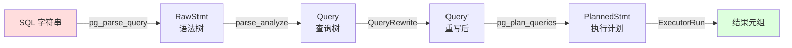
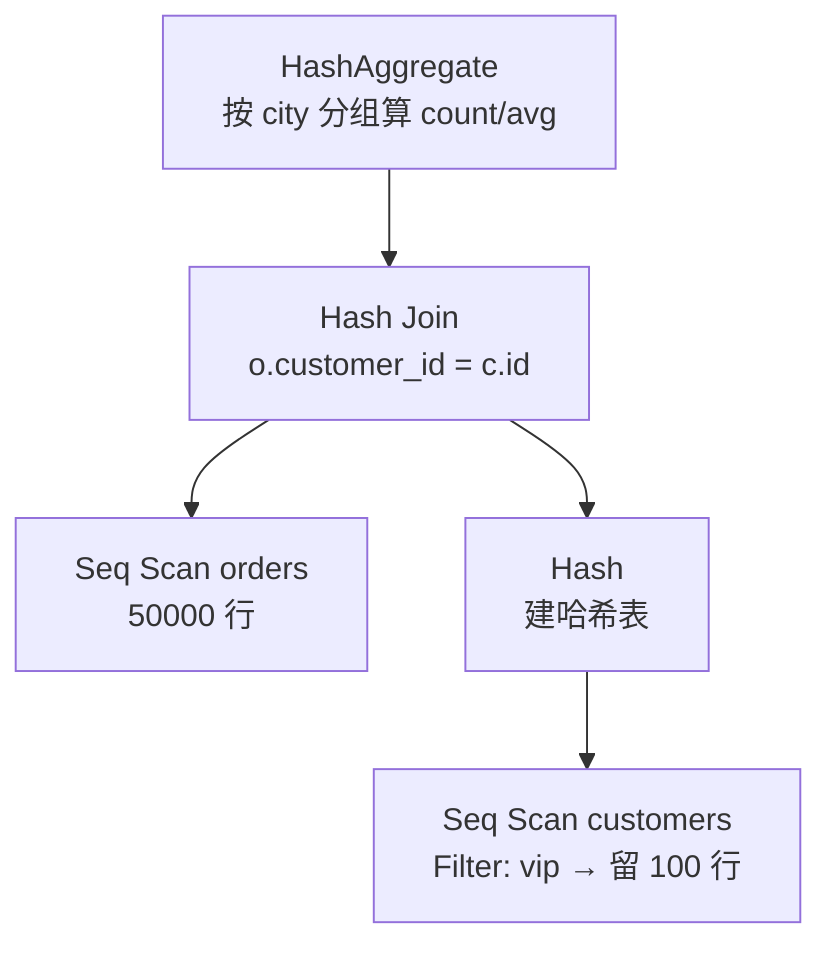
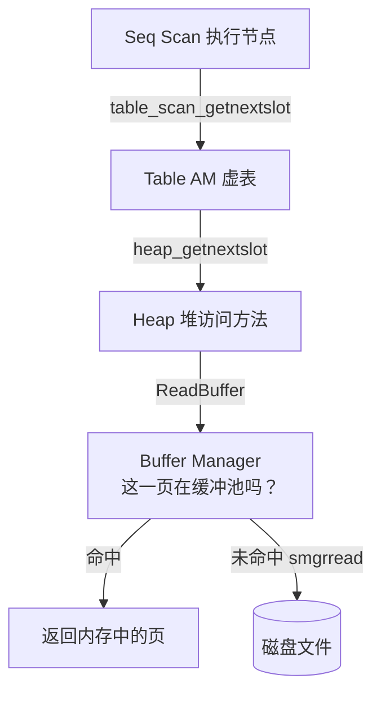
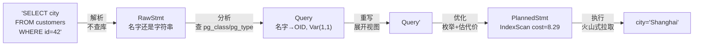

# 01 · 一条 SQL 的奇幻漂流

> 我们拿一条真实的查询，跟着它走完从字符串到磁盘读取的全程。每一步都会 dump 出 PostgreSQL 内部**真实的数据结构**——不是示意图，是 `debug_print_*` 打出来的原物。读完这篇，你脑子里会有一条贯穿整个内核的主线，后面所有文章都挂在这条线上。

环境与数据集见[系列总入口](README.md)。

---

## 主角：两条查询

我们用两条查询，一简一繁：

```sql
-- 查询 A（简单，用来看清每个阶段的数据结构长什么样）
SELECT city FROM customers WHERE id = 42;

-- 查询 B（带 join 和聚合，用来看优化器和执行器的真本事）
SELECT c.city, count(*), avg(o.amount)
FROM customers c JOIN orders o ON o.customer_id = c.id
WHERE c.vip
GROUP BY c.city;
```

先看全局。一条 SQL 字符串进来，要穿过五道关：



这条流水线的代码主干在 `exec_simple_query()`（`src/backend/tcop/postgres.c:1029`）。我们逐关来看。

---

## 第一关：解析（Parser）—— 只认语法，不认数据库

`pg_parse_query()`（`postgres.c:616`）把字符串交给 flex 词法器 + bison 语法器，吐出一棵**原始语法树**（RawStmt）。这一步有一条铁律，写在 `parser.c` 的开头（`src/backend/parser/parser.c:6`）：

```
 * Note that the grammar is not allowed to perform any table access
```

**语法分析阶段绝不查数据库。** 此刻 `customers` 这张表存不存在、`city` 是什么类型，解析器一概不知道、也不关心。它只确认这串字符在语法上是合法的 SELECT，把 `customers`、`city`、`42` 这些原封不动地塞进语法树。

为什么这么轴？因为一段多语句字符串（比如 `CREATE TABLE t; INSERT INTO t ...`）会被**整体**解析完，才执行第一条。解析 `INSERT` 那行时，`t` 还没被建出来。所以一切要查目录的活儿，都推迟到下一关。

> 想深入词法器的"无回溯"设计、`base_yylex` 如何把多 token 前瞻压成 LALR(1)，见 [query/01-parser](../architecture/query/01-parser.md)。

---

## 第二关：分析（Analyzer）—— 第一次碰数据库

`parse_analyze_*()` 把语法树变成**查询树**（Query）。这是第一个会查系统表的阶段：把名字解析成 OID、推导类型、做语义检查。

光说不练假把式。我们让 PostgreSQL 把查询 A 的查询树**真的打印出来**：

```sql
SET debug_print_parse = on;
SET client_min_messages = log;
SELECT city FROM customers WHERE id = 42;
```

日志里吐出一棵 `Query` 节点（我截取关键部分，去掉一堆 false 字段）：

```lisp
{QUERY
 :commandType 1                      -- 1 = SELECT
 :rtable (
    {RANGETBLENTRY
    :eref {ALIAS :aliasname customers :colnames ("id" "name" "city" "vip")}
    :rtekind 0                       -- 0 = 普通表
    :relid 16478                     -- ← customers 的 OID（名字已解析成 OID！）
    :relkind r
    })
 :jointree
    {FROMEXPR
    :fromlist ({RANGETBLREF :rtindex 1})    -- 引用 rtable 第 1 项
    :quals                                   -- WHERE 条件
       {OPEXPR
       :opno 96                              -- ← 运算符 OID
       :opfuncid 65                          -- ← 实现函数 OID
       :opresulttype 16                      -- 结果类型 = bool
       :args (
          {VAR :varno 1 :varattno 1 :vartype 23 ...}   -- customers.id
          {CONST :consttype 23 :constvalue ... 42 }    -- 常量 42
       )}}
 ...}
```

这棵树值得盯着看一会儿，因为**解析与分析的区别全在这里**。原来字符串里的名字，现在全变成了数字：

| 源码里的 | 查询树里 | 我们查证一下 |
|---------|---------|-------------|
| 表 `customers` | `:relid 16478` | `SELECT relname FROM pg_class WHERE oid=16478;` → `customers` |
| 运算符 `=` | `:opno 96` | `SELECT oprname,oprcode FROM pg_operator WHERE oid=96;` → `=` / `int4eq` |
| `=` 的实现 | `:opfuncid 65` | `SELECT proname FROM pg_proc WHERE oid=65;` → `int4eq` |
| 列 `id` | `{VAR :varno 1 :varattno 1 :vartype 23}` | `vartype 23` → `int4` |
| 条件结果 | `:opresulttype 16` | `16` → `bool` |

我真的去查了这些 OID，全部对得上：

```
opno 96  = = (int4eq)
func 65  = int4eq
type 23  = int4        -- id 的类型
relid 16478 = customers
```

几个要记住的关键抽象：

- **`Var`** 表示"对某个列的引用"。它不存列名，存的是 `varno`（这列来自 rtable 的第几项）+ `varattno`（第几列）。`{varno 1, varattno 1}` 就是"rtable 第 1 项（customers）的第 1 列（id）"。整个内核都用这套**整数下标**引用列，名字早在这里就被丢掉了。
- **`rtable`**（range table）是 FROM 里所有数据来源的扁平列表。后面 `varno`、各种 `rtindex` 都是它的下标。
- 运算符 `=` 被解析成了 `int4eq` 函数——因为 `id` 是 int4。要是写 `WHERE name = 'x'`，解析出来就是另一个针对 text 的相等函数。**这就是为什么解析阶段不能做这件事：得先知道列的类型。**

> 类型推导、函数重载决议、`GROUP BY` 校验这些细节，见 [query/02-analyzer](../architecture/query/02-analyzer.md)。

---

## 第三关：重写（Rewriter）—— 视图在这里被拆穿

`QueryRewrite()`（`src/backend/rewrite/rewriteHandler.c:4781`）应用规则系统：展开视图、应用 `CREATE RULE` 定义的规则、注入行级安全策略。

我们的查询没碰视图，所以这关基本是透传。但有个反常识的事实值得记一笔：**视图在 PostgreSQL 里不是什么特殊机制，它就是一条自动建的规则。** `CREATE VIEW v AS SELECT ...` 会偷偷建一条"ON SELECT DO INSTEAD"规则，重写器读到查询引用了 `v`，就用规则里存的子查询把它替换掉。一个机制（规则系统）复用出了视图——这是 PostgreSQL 反复出现的正交设计。

> 视图展开、可更新视图、RLS 的细节见 [query/03-rewriter](../architecture/query/03-rewriter.md)。

---

## 第四关：优化（Planner）—— 在一个巨大的空间里找最便宜的路

到这里，查询树说的是「要什么」。优化器 `pg_plan_queries()`（`postgres.c:987`）要决定「怎么做」，产出 **PlannedStmt**——一棵物理执行计划。

还是先看真东西。查询 A 的计划树（`SET debug_print_plan = on`）：

```lisp
{PLANNEDSTMT
 :commandType 1
 :planTree
    {INDEXSCAN                          -- ← 选了索引扫描！
    :scan.plan.startup_cost 0.275
    :scan.plan.total_cost 8.2925        -- ← 优化器估算的代价
    :scan.plan.plan_rows 1
    :scan.plan.targetlist (
       {TARGETENTRY
       :expr {VAR :varno 1 :varattno 3 :vartype 25 ...}   -- city（第3列，text）
       :resno 1})
    ...}}
```

对照查询树看，发生了两件事：

1. 选择了 **IndexScan**（而不是全表扫描）。优化器看到 `WHERE id = 42` 能用主键索引，且估算只返回 1 行，索引扫描更便宜。
2. 输出从查询树的"整个 WHERE 表达式"变成了具体的 `targetlist`：只取 `city`（`varattno 3`，类型 25 = text）。

用 `EXPLAIN` 看同一个计划的人类可读版：

```sql
postgres=# EXPLAIN (VERBOSE) SELECT city FROM customers WHERE id = 42;
                                      QUERY PLAN
---------------------------------------------------------------------------------------
 Index Scan using customers_pkey on public.customers  (cost=0.28..8.29 rows=1 width=8)
   Output: city
   Index Cond: (customers.id = 42)
```

注意 `cost=0.28..8.29` 正是计划树里那个 `total_cost 8.2925` 的四舍五入。**EXPLAIN 不是事后分析，它就是把优化器选中的那棵计划树翻译给你看。**

### 优化器在搜索什么

简单查询看不出优化器的本事。换查询 B——三表逻辑、聚合、过滤。优化器要回答：
- `customers` 和 `orders` 各用什么方式扫？
- 两张表用什么算法连接（嵌套循环 / 归并 / 哈希）？谁做内表谁做外表？
- 聚合用哈希分组还是排序分组？

它的做法是**基于代价的枚举**：为每张表、每种连接方式生成一个个候选「路径」（Path），用代价模型估算每条路的开销，留下最便宜的。这个搜索空间随表数量阶乘式增长,所以有一套动态规划算法来组织（[query/04](../architecture/query/04-planner-overview.md)、[05](../architecture/query/05-planner-paths-joins.md)详述）。

我们直接看它的决策结果——这就引出最后一关。

---

## 第五关：执行（Executor）—— 火山式按需拉取

`ExecutorRun()` 拿着计划树，真正去读数据、算结果。我们用 `EXPLAIN (ANALYZE, BUFFERS)` 跑查询 B，这会**真的执行**它并报告实测数据：

```sql
EXPLAIN (ANALYZE, BUFFERS, VERBOSE, TIMING OFF, SUMMARY OFF)
SELECT c.city, count(*), avg(o.amount)::numeric(10,2)
FROM customers c JOIN orders o ON o.customer_id = c.id
WHERE c.vip
GROUP BY c.city;
```

真实输出（在本文环境实跑，未修饰）：

```
 HashAggregate  (cost=1006.56..1006.62 rows=4 width=32) (actual rows=2.00 loops=1)
   Group Key: c.city
   Batches: 1  Memory Usage: 32kB
   Buffers: shared hit=326
   ->  Hash Join  (cost=18.25..969.06 rows=5000 width=14) (actual rows=5000.00 loops=1)
         Hash Cond: (o.customer_id = c.id)
         Buffers: shared hit=326
         ->  Seq Scan on orders o  (cost=0.00..819.00 rows=50000 width=10) (actual rows=50000.00)
               Buffers: shared hit=319
         ->  Hash  (cost=17.00..17.00 rows=100 width=12) (actual rows=100.00 loops=1)
               Buckets: 1024  Batches: 1  Memory Usage: 13kB
               Buffers: shared hit=7
               ->  Seq Scan on customers c  (cost=0.00..17.00 rows=100 width=12) (actual rows=100.00)
                     Filter: c.vip
                     Rows Removed by Filter: 900
                     Buffers: shared hit=7
```

这棵计划树是这样的形状：



### 火山模型：父节点向子节点「要一行」

执行器用的是**火山模型**（Volcano，又叫迭代器模型）：每个节点都实现一个统一的"给我下一行"接口（`ExecProcNode`），父节点反复调子节点来拉数据。`execProcnode.c:54` 的注释把这讲得很清楚：

```
 *  When ExecutorRun() is called, it calls ExecutePlan() which calls
 *  ExecProcNode() repeatedly on the top node of the plan state tree.
```

具体到我们这棵树，数据是这样流动的：

1. `HashAggregate` 想要一行结果 → 反复向 `Hash Join` 要行，攒齐所有行才能算完分组。
2. `Hash Join` 第一次被调用时，先把**内表**（customers）整个拉过来建哈希表（那个 `Hash` 节点）。
3. 然后它向**外表**（orders）一行一行要，每要到一行就拿 `customer_id` 去哈希表里探测，命中就拼成连接行往上吐。
4. `Seq Scan` 则一页一页读堆表，逐行往上交。

读这个真实输出，有几处特别值得玩味：

- **`Rows Removed by Filter: 900`**：customers 有 1000 行，`WHERE c.vip` 滤掉了 900 行非 VIP 的，只剩 100 行进哈希表。这个数字是 VIP 占 10% 的直接体现。
- **`Buffers: shared hit=326`**：整条查询命中了 326 个缓冲页，**全部命中、零磁盘读**（没有 `read=`）——因为数据刚 `ANALYZE` 过还在缓冲池里。orders 的 319 个页 + customers 的 7 个页，正好对上各自的表大小。
- **`Batches: 1`**：哈希表没溢出到磁盘。100 行的内表轻松装进 `work_mem`。要是内表很大，这里会变成多个 batch，溢出到临时文件——那是另一个故事（[query/08](../architecture/query/08-executor-nodes.md)）。
- **`actual rows` vs `rows`（估算）**：Hash Join 估 5000、实际 5000，估得很准；HashAggregate 估 4 组、实际 2 组（只有 VIP 客户分布在 2 个城市）。估算准不准直接决定计划好不好。

火山模型有个优雅的副作用：**它天然支持早停**。如果查询 B 后面加个 `LIMIT 1`，HashAggregate 拿到第一行就能停，下面的节点不必算完——按需拉取，要多少算多少。

> 各执行节点（HashJoin 的分批算法、聚合的四种策略、排序的内外存切换）见 [query/06](../architecture/query/06-executor-overview.md) ~ [08](../architecture/query/08-executor-nodes.md)。表达式（那些 `=`、`avg`）其实也被"编译"成了指令序列再解释执行，见 [query/07](../architecture/query/07-executor-expr.md)。

---

## 但故事还没完：数据在哪？

执行器里那句 `Seq Scan on orders`，看似简单地"读表"，背后其实是一整个存储栈在工作。当它要"下一行"时：



每一行都要：判断这一页在不在缓冲池（那个 `shared hit`），不在就从磁盘读进来；读到行还要判断它对当前事务**可见不可见**（MVCC——别的事务可能正在改它或刚删了它）。

而当查询是 `INSERT/UPDATE/DELETE` 时，故事更长：每个改动都要先写 **WAL**（预写日志）才能改数据页，这样崩溃了才能恢复。

这些——堆与页面、缓冲池、MVCC、WAL——就是这个系列**主线二和主线三**要讲的。我们这条 SQL 的漂流，到执行器交出结果为止告一段落，但它脚下的存储与事务大陆，才刚刚露出海岸线。

---

## 把这一篇收进脑子

一张图记住全程：



- 解析**不碰数据库**，只产出名字还是字符串的语法树。
- 分析是**第一次查库**，把名字变成 OID、把 `Var` 变成 `(rtable下标, 列号)`。
- 优化器**枚举候选路径、按代价择优**，`EXPLAIN` 看到的就是它选中的计划树。
- 执行器用**火山模型按需拉取**，每个节点向子节点要下一行。
- 而 `Seq Scan` 的"读一行"背后，是 Table AM → Heap → Buffer → 磁盘的一整条存储栈。

下一篇起，我们分头深入这五关。先从最常被误解的一关开始：解析器为什么宁可"笨"也不查数据库——这个看似古板的约束，其实撑起了 PostgreSQL 处理事务、缓存计划、扩展类型的半壁江山。

---

**上一篇** ← [00 · 为什么要读 PostgreSQL 源码](00-prologue.md)
**下一篇** → 02 · 解析器：为什么语法分析不许碰数据库（编写中）

**对应参考文档**：本篇横跨 [query/01](../architecture/query/01-parser.md) ~ [08](../architecture/query/08-executor-nodes.md)，需要精确结构体与行号时去那里。
