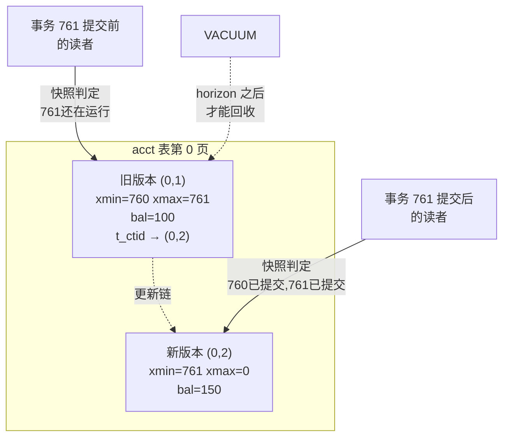

# 11 · MVCC：写不阻塞读的秘密

> 这是一篇「模块深潜」样板。我们从一个所有数据库都要回答的难题出发，看 PostgreSQL 的解法，然后用 `pageinspect` 把答案从磁盘字节里**亲手扒出来**——包括它优雅之处，和它要付出的代价。

环境与数据集见[系列总入口](README.md)。本篇主要用一张小表，可直接跟着跑。

---

## 一个绕不开的难题

并发数据库永远要回答：**当一个事务正在读一行，另一个事务要改这一行，怎么办？**

最朴素的答案是加锁：读的时候上读锁，写的时候上写锁，读写互斥。简单，但代价惨重——一个跑了 10 秒的报表查询，会把它扫过的每一行都锁住，期间谁都别想改。OLTP 系统里这等于自杀。

PostgreSQL（以及大多数现代数据库）的答案是 **MVCC——多版本并发控制**。一句话概括它的世界观：

> **更新不是修改，而是追加一个新版本；删除不是抹去，而是打个"死亡"标记。旧版本留在原地，让还在读它的人继续读。**

于是「写」和「读」操作的是**不同的版本**，自然不打架。读者永远不被写者阻塞，写者也不被读者阻塞。听起来很美，但魔鬼在细节里——而细节，我们可以直接看到。

---

## 把版本扒出来看

建一张最简单的表，插一行钱：

```sql
CREATE TABLE acct (id int PRIMARY KEY, bal int);
INSERT INTO acct VALUES (1, 100);
```

每行除了你定义的列，还藏着几个**系统列**。最关键的是 `xmin` 和 `xmax`：

```sql
postgres=# SELECT ctid, xmin, xmax, * FROM acct;
 ctid  | xmin | xmax | id | bal
-------+------+------+----+-----
 (0,1) |  760 |    0 |  1 | 100
```

- **`xmin = 760`**：创建这一行的事务 ID 是 760。
- **`xmax = 0`**：还没有事务删除它（0 表示"活着"）。
- **`ctid = (0,1)`**：它的物理地址——第 0 页，第 1 个位置。

现在,关键时刻——我们**更新**这行余额：

```sql
postgres=# UPDATE acct SET bal = 150 WHERE id = 1;
postgres=# SELECT ctid, xmin, xmax, * FROM acct;
 ctid  | xmin | xmax | id | bal
-------+------+------+----+-----
 (0,2) |  761 |    0 |  1 | 150
```

看出名堂了吗？`bal` 变成了 150，但 **`ctid` 从 `(0,1)` 变成了 `(0,2)`，`xmin` 从 760 变成了 761**。这不是"把 100 改成 150"——这是在 `(0,2)` 这个新位置，由事务 761 **创建了一个全新的版本**。

那旧版本 `(0,1)` 去哪了？它**还在物理页里**。我们用 `pageinspect` 直接读这一页的原始内容：

```sql
postgres=# SELECT lp, t_ctid, t_xmin, t_xmax,
                  (t_infomask & 256) <> 0  AS xmin_committed,
                  (t_infomask2 & 16384) <> 0 AS hot_updated
           FROM heap_page_items(get_raw_page('acct', 0));
 lp | t_ctid | t_xmin | t_xmax | xmin_committed | hot_updated
----+--------+--------+--------+----------------+-------------
  1 | (0,2)  |    760 |    761 | t              | t           ← 旧版本
  2 | (0,2)  |    761 |      0 | t              | f           ← 新版本
```

一张页里**两条元组**，整个 MVCC 的机制都摊在这张表里了：

- **`lp 1`（旧版本）**：`t_xmin=760`（事务 760 创建），`t_xmax=761`（事务 761 删了它）。它的 `t_ctid` 不再指向自己，而是指向 `(0,2)`——**指向它的新版本**，串成一条"更新链"。
- **`lp 2`（新版本）**：`t_xmin=761`（事务 761 创建），`t_xmax=0`（活着）。

所以「UPDATE 一行」在物理上是：**给旧版本盖上 `t_xmax=761` 的死亡戳，在新位置放一个新版本，旧版本用 `t_ctid` 指向新版本。**

> 顺带，`hot_updated=t` 说明这是一次 **HOT 更新**——因为 `bal` 没有索引，新版本能放进同一页，PostgreSQL 就省掉了更新索引的开销。这是另一个精巧优化，见 [storage/11-heap](../architecture/storage/11-heap.md)。

---

## 谁能看到哪个版本？——快照

现在有了两个版本，核心问题来了：一个事务来查 `acct`，**它该看到 100 还是 150？**

答案藏在「**快照（snapshot）**」里。每个查询开始时会拿一个快照，它本质上是一句话：「**此时此刻，哪些事务已经提交了？**」快照结构（`SnapshotData`）里最关键的三样东西（`src/include/utils/snapshot.h:153`）：

```c
TransactionId xmin;   // 所有 XID < xmin 的事务都已结束（结果已确定）
TransactionId xmax;   // 所有 XID >= xmax 的事务都是"未来"，一律不可见
TransactionId *xip;   // 在 [xmin, xmax) 之间，此刻还在运行的 XID 列表
```

判断一行版本可见与否，逻辑（`HeapTupleSatisfiesMVCC()`，`src/backend/access/heap/heapam_visibility.c:939`）可以粗略概括成两句话：

```
这个版本可见  ⟺  创建它的事务（t_xmin）在我的快照里"已提交"
            并且  删除它的事务（t_xmax）在我的快照里"还没提交"（或不存在）
```

套用到我们的例子：
- 旧版本 `(0,1)`：`t_xmin=760` 已提交、但 `t_xmax=761` 也已提交 → **不可见**。
- 新版本 `(0,2)`：`t_xmin=761` 已提交、`t_xmax=0` → **可见**。

所以更新提交后，新查询看到 150。但如果在事务 761 **提交之前**，有另一个事务拿了快照来查——那个快照里 761 还在运行（在 `xip` 列表里），于是对它来说：新版本 `(0,2)` 的创建者还没提交（不可见），旧版本 `(0,1)` 的删除者也还没提交（仍可见）→ **它看到的是旧值 100**。

**这就是"写不阻塞读"的全部秘密**：写者制造新版本、给旧版本打删除戳，但只要它没提交，读者通过快照判定，看到的还是那个完好的旧版本。没有谁等谁。

> 快照怎么获取（扫描共享内存里的 `ProcArray`）、隔离级别（READ COMMITTED 每条语句拿新快照，REPEATABLE READ 整个事务用一个快照）的区别，见 [transaction/32-mvcc-snapshot](../architecture/transaction/32-mvcc-snapshot.md)。

---

## 天下没有免费的午餐：膨胀与 horizon

MVCC 如此优雅，代价是什么？**那些旧版本（死元组）会越堆越多。** 每次 UPDATE/DELETE 都留下垃圾。我们故意制造一些：

```sql
-- 反复更新同一行 20 多次
DO $$ BEGIN FOR i IN 1..20 LOOP UPDATE acct SET bal=bal+1 WHERE id=1; END LOOP; END $$;

postgres=# SELECT tuple_count, dead_tuple_count FROM pgstattuple('acct');
 tuple_count | dead_tuple_count
-------------+------------------
           1 |               21     ← 1 个活的，21 个死的
```

一行有效数据，背后拖着 21 具"尸体"。回收它们是 **VACUUM** 的活儿。但 VACUUM 不能想删就删——它必须确保**没有任何还活着的快照可能再看到这个死版本**。

这条安全线叫 **xmin horizon**：所有当前活动事务里最老的那个 xmin。比它还老、且已删除的版本才能回收。

我们来亲眼看 horizon 如何"卡住"回收。开一个**长事务**占住一个老快照，同时另一边疯狂制造死元组，然后 VACUUM：

```sql
-- 会话 A：开一个 REPEATABLE READ 事务，赖着不提交（占住一个老快照）
BEGIN ISOLATION LEVEL REPEATABLE READ;
SELECT 1;   -- 拿到快照，此后 horizon 被它钉住

-- 会话 B：制造一堆死元组，然后试图回收
UPDATE acct SET bal=bal+1 WHERE id=1;   -- ... 重复多次
VACUUM acct;
SELECT tuple_count, dead_tuple_count FROM pgstattuple('acct');
 tuple_count | dead_tuple_count
-------------+------------------
           1 |               21     ← VACUUM 跑了，却一个都没回收！
```

VACUUM 明明执行了，死元组却**纹丝不动**。因为会话 A 那个老快照"可能"还要看这些版本，PostgreSQL 不敢动。一旦会话 A 结束：

```sql
-- 会话 A：
COMMIT;

-- 会话 B：再 VACUUM 一次
VACUUM acct;
SELECT tuple_count, dead_tuple_count FROM pgstattuple('acct');
 tuple_count | dead_tuple_count
-------------+------------------
           1 |                0     ← 全回收了
```

死元组瞬间清零。

**这个实验解释了生产环境最常见的一类事故**：一个忘了提交的事务、一个挂着的 `idle in transaction` 连接、一个跑了几小时的报表，都会把 horizon 钉在过去，导致全库的死元组**无法回收**，表和索引疯狂膨胀，磁盘暴涨，查询变慢。监控里那句 `age(backend_xmin)` 很大的长事务，就是元凶。下次遇到莫名膨胀，先去 `pg_stat_activity` 抓最老的事务：

```sql
SELECT pid, state, age(backend_xmin) AS xmin_age, now()-xact_start AS duration, query
FROM pg_stat_activity
WHERE backend_xmin IS NOT NULL
ORDER BY age(backend_xmin) DESC;
```

---

## 一图收尾



记住三件事：

1. **UPDATE = 旧版本打 `xmax` 戳 + 新位置建新版本**，旧版本不删，靠 `t_ctid` 串成更新链。
2. **可见性 = 用快照判断 `xmin`/`xmax` 这两个事务的提交状态**。这让读写操作不同版本，互不阻塞。
3. **代价是死元组膨胀**，靠 VACUUM 回收；而 VACUUM 被全局最老的活动事务（horizon）卡着——**长事务是膨胀的头号杀手**。

MVCC 还有很多没讲到的角落：HINT bits 如何缓存事务提交状态避免反复查 CLOG、READ COMMITTED 下 UPDATE 撞上并发修改时的 EvalPlanQual 重试、SERIALIZABLE 如何用谓词锁补上快照隔离的漏洞。这些都在参考文档里。但「版本 + 快照 + horizon」这三件套，是你理解 PostgreSQL 并发的地基。

---

**对应参考文档**：[transaction/32-mvcc-snapshot](../architecture/transaction/32-mvcc-snapshot.md)（可见性算法、快照获取、隔离级别）、[transaction/31-clog-slru](../architecture/transaction/31-clog-slru.md)（事务状态存储、HINT bits）、[storage/11-heap](../architecture/storage/11-heap.md)（HOT、VACUUM）、[concurrency/23-predicate-ssi](../architecture/concurrency/23-predicate-ssi.md)（可串行化）。

**回到** → [系列总入口](README.md)
